Agility LAB: Essential App Protect   
=========================================== 

.. contents:: Table of Contents   

Pre-Requisites
###############

- Any modern browser: for working with the UI (and this document)
- Postman: for working with the API of the F5 Cloud Services
- Opera browser: for simulating geo-location specific traffic

Lab Environment Overview
###############################

1. APIs and Services 
*********************

This Lab utilizes standard *F5 Cloud Services API*, as well as a *Lab Service API*, which was custom-built just for executing this lab: 

* **F5 Cloud Services API**: create, use, and remove the services in scope of this lab 

* **Lab service API**: facilitates auxiliary functions for the lab only: creating DNS entries, sending targeted requests & traffic to the apps/services, etc.  

The following diagram captures the core components of this Lab: 

 .. figure:: _figures/Diagram.png

Lab Environment Setup  
############################### 

1. F5 Cloud Services Portal 
*************************** 

`a)` Login   

In order to use F5 Cloud Services, you need to be logged in with a valid user account. If you need to sign up, or if you already have one, proceed to the `F5 Cloud Services portal <http://bit.ly/f5csreg>`_.  

.. figure:: _figures/1.png  

Once you've logged in with an account, you will be using the user name and password values in the lab to authenticate with the F5 Cloud Services and the API.

`b)` Subscribe to Catalogs   

In order to access specific F5 Cloud Services, you need to subscribe to the corresponding service catalogs.

   `1.` Click on the **Your F5 Cloud** tab in the left navigation panel and you will see the available service catalogs, as well as services you have subscribed to, if any. For this lab you will need to click **Subscribe** to **Essential App Protect** services.   

   .. figure:: _figures/2.png  

   `2.` You will be asked to add your payment card to cover service usage (you only pay for what you use). Note that if you're running this lab at the Agility event, you will be provided with Trial/Free access to the F5 Cloud Servies (speak to the Lab facilitator if you don't have access).   

   .. figure:: _figures/3.png  

   After successful subscribing, your services will appear in the **Your F5 Cloud** tab. You will also see their current status.   

   .. figure:: _figures/4.png  

   If you need to check your payment information, it is available in the **Accounts** tab, **Payment** section.   

   .. figure:: _figures/5.png 

2. Postman Configuration  
********************* 

`a)` Download Postman `here <http://bit.ly/309wSLl>`_, open it, create a Postman account if you don’t have one and choose to do so, and sign in.  

`b)` Import collection – **F5 Cloud Services EAP LAB.postman_collection.json** and environment – **F5 Cloud Services EAP LAB.postman_environment.json**.  

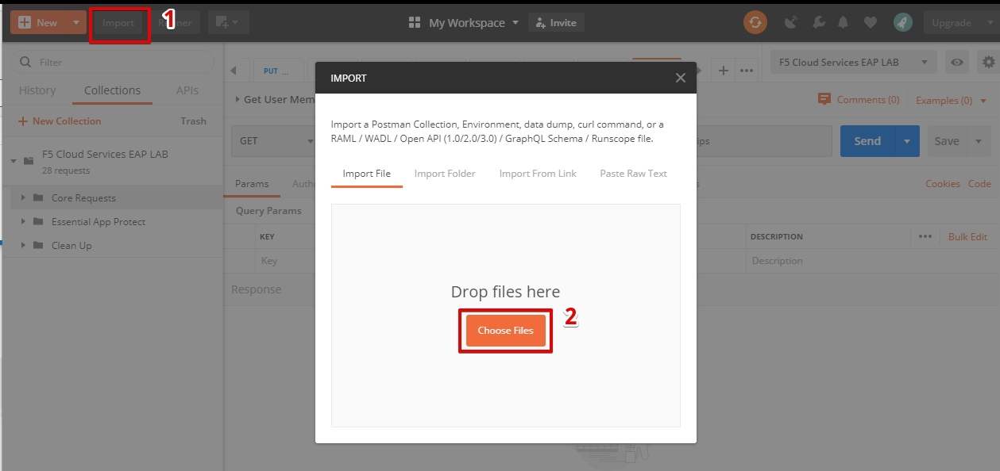

You will now see your collection (left side) with calls in several categories, as well as environment variables (top right).  

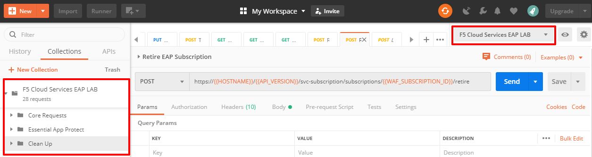

You are now ready to interface with the F5 Cloud Services using Postman. 

3. Domain Name  
************** 

In order to create Essential App Protect instance in the F5 Cloud Services portal, you need to have a record name to be used as your domain name. Use Postman and follow the steps below to get the Record name from the Lab service API.     

`a)` Open the “F5 Cloud Services EAP LAB” environment variables by clicking the “Environment Quick Look”, click into the field of the corresponding variable, and type the value of user email in the variable “USER_EMAIL” (click **Enter** after typing the values).  

Repeat the same for the “USER_PASSWORD”.  

`b)` Select the **Login** request in the sidebar to login to your F5 Cloud Services profile and click **Send** to get the authorization token. More detailed information on this API request can be found `here <http://bit.ly/36ffsyy>`_.  

.. figure:: _figures/93.png 

A successful login will result in Postman returning the tokens from the API, shown in the response body below:  

These tokens are then stored for subsequent calls using a function inside Postman to set environment variables. You can see the test function in the “Tests” tab:  

**NOTE**: If any of the subsequent Postman calls return a blank response or **"status": "unauthorized"** response (see the screenshot below), it means your user token has expired and you will need to re-login. To do that you just need to re-send the **Login** request.  

.. figure:: _figures/10.jpg  

`c)` Retrieve User ID & Account ID  

Select the **Get Current User** request and click **Send** to retrieve User ID and Account ID to be used in the further requests.  

The response returns the following detail:  

The retrieved User ID and Account ID are then stored for subsequent calls.  

.. figure:: _figures/11.jpg  

More detailed information on this API request can be found `here <http://bit.ly/37hyQw3>`_.  

`d)` Let’s now retrieve EAP Record Name with the **Get EAP record (lab)** API call. Click **Send**. This call will pass your “ACCESS_TOKEN” in the header of the request to the Labs API in order to get a record that will be used to create EAP instance in F5 Cloud Services UI.  

Request:  

The response will return your record name, its status, current type and IP. 

Note that in subsequent requests record type will be changed to CNAME in order to change DNS settings and let traffic go through Essential App Protect. Record IP will be used by the F5 Cloud Services portal to find the nearest available instance when creating Essential App Protect service.    

**SCREENSHOT** 

Sending this request will automatically capture of the Record variables:  

.. figure:: _figures/26.jpg  

This Record Name will be used for creating Essential App Protect service in the F5 Cloud Services portal, as well as throughout the lab as the domain name for your test applications. 

`e)` Get User Membership to F5 Cloud Services accounts

In Postman, send the **Get User Membership** request which returns info on your user’s access to Cloud Services accounts.

**TO BE UPDATED** 

`f)` Retrieve information on available catalogs and their IDs

Select the **Get Catalogs** request and click **Send** to retrieve data about the available Catalogs and their IDs.

**TO BE UPDATED** 

4. Opera with VPN to Test New Endpoints 
****************************************

You will need the Opera browser to test proximity rules we will set later.

Open the Opera browser, click **Settings, Advanced, Features** and then **Enable VPN**.

**SCREENSHOT**

Essential App Protect 
##################### 

1. Create Essential App Protect Service via the F5 Cloud Services Portal  
************************************************************************ 

`a)` In order to create Essential App Protect service, open the **Get EAP record (lab)** request in Postman and copy **"record"** name in the response.  

**SCREENSHOT 115**

`b)` Go to the F5 Cloud Services portal, open the **Essential App Protect** tab and click **Start protecting your app**. 

`c)` Paste the record name you copied in step 1.a) above into "Fully Qualified Domain Name (FQDN)" field and click **Save & Continue**.

Using record IP, the system will look for the nearest instance, gather app endpoint and region detail, show them and ask you to **Save & Continue**.  

As you can see, the endpoint belongs to North America, US East (N. Virginia) and is deployed on Amazon AWS.  

`d)` The system will ask you to provide a SSL/TLS certificate. Let’s tick “I will provide certificate details later” and **Save & Continue**.  

.. figure:: _figures/99.png 

`e)` Enable all the methods of protection and click **Save & Continue**. In case you need to update this property, you can do it later in "PROTECT APPLICATION" section. 

`f)` Click **Done** and Essential App Protect service will be created and ready for use.  

.. figure:: _figures/101.png  

Now that your Essential App Protect instance is created, we need to change DNS settings using CNAME and start routing the traffic through Essential App Protect. To do that follow the steps below.  

2. Update DNS Settings using CNAME  
******************************** 

`a)` Let's test if DNS settings are updated and the traffic is protected by Essential App Protect. In the F5 Cloud Services portal, open the **DNS Settings** tab in **PROTECT APPLICATION** and click **Test updated DNS**.

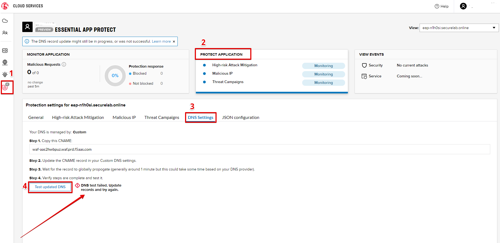

As you can see, it's not successful. We will update DNS settings using Postman to fix that.

`b)` Go back to Postman to change the DNS settings. Send the **Get EAP Subscription** request to get the "subscription_id" and "CNAME" using your "ACCESS_TOKEN".

**SCREENSHOT**

The response will return all information on your instance which we have created via UI: 

**SCREENSHOT**

The retrieved ID and CNAME are then stored for subsequent calls using a function inside Postman to set environment variables. You can see the test function in the **Tests** tab:

**SCREENSHOT**

`c)` Send the **Update EAP DNS Record (lab)** to update DNS Settings with CNAME generated when creating Essential App Protect instance in F5 UI and retrieved in the step above:

**SCREENSHOT** 

The response will show the updated type (""CNAME") and value: 

**SCREENSHOT** 

`d)` Let’s now test if CNAME change is completed correctly.   

Return to the F5 Cloud Services portal, open **Essential App Protect** tab, select your app from the dropdown menu and click **PROTECT APPLICATION**. Then open **DNS Settings** tab and click **Test updated DNS**.  

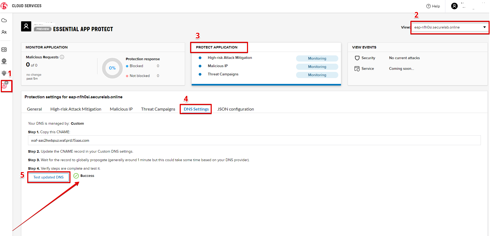

You will see successful status of testing.

`e)` Let's now go back to Postman and re-send the **Get EAP record (lab)** request to see the current type of the record. 

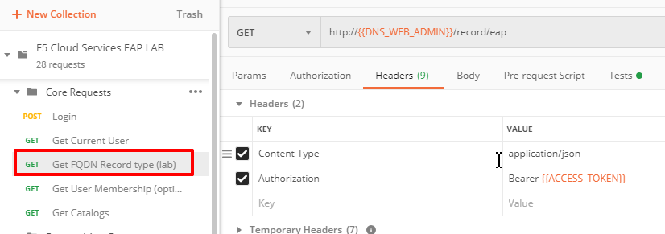

The response will show that record type is changed from "A" to "CNAME" (see step 3.d) above), as well as "value" is updated, which means that app traffic now goes through Essential App Protect instance and is actively protected.   

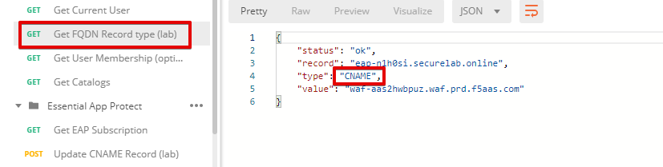

`f)` Test via Browser

Let's now test the updated DNS setting via browser. Return to the F5 Cloud Services portal, open the **DNS Settings** tab and copy the CNAME.

.. figure:: _figures/130.png

Paste it into your browser and you will see the NA2 instance of the Auction website and all of the requests will now be flowing through the Essential App Protect. However, any malicious requests will not be blocked, as we have not turned on "Blocking" mode yet.

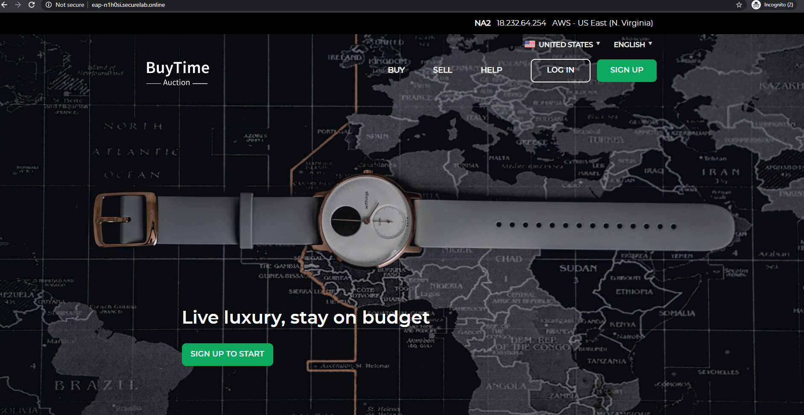

3. Attacks  
*********** 

There are three types of attacks:  

`1)` SQL Injection 

This attack inserts a SQL query via the input data field in the web application. Such attacks could potentially read sensitive data, modify and destroy it. More detailed information can be found `here <http://bit.ly/2RfmXkw>`_.

`2)` Illegal Filetype 

This attack combines valid URL path segments with invalid input to guess or brute-force download of sensitive files or data. More detailed information can be found `here <http://bit.ly/30NrAFF>`_.  

`3)` Threat Campaign 

These types of attacks are the category that F5 Labs tracks as coordinated campaigns that exploit known vulnerabilities. This particular attack simulates using a known Tomcat backdoor vulnerability. The complete list of such threats can be found `here <http://bit.ly/36bPmfG>`_.   

Let’s now try and simulate an attack.

Go back to Postman and send the **Attack: Threat Campaign** request. 

**SCREENSHOT** 

The attack will be shown in the Essential App Protect "VIEW EVENTS" section of the F5 Cloud Services portal.

**SCREENSHOT** 

You can see that its status is "Not blocked" for now. 

4. Update Monitoring to Blocking via UI 
******************************** 

By default, all the threats of your app are only monitored without any actions taken. You can change mornitoring to blocking either via UI or via Postman. 

`a)` To start blocking attacks, go to the **PROTECT APPLICATION** tab, then open the type of attack you want to block, toggle **Blocking Mode** on and click **Update** to save the settings:  

.. figure:: _figures/105.png 

`b)` Testing the status 

Now that the protection mode is "blocking", you can re-send the **Attack: Threat Campaign** request in Postman. After that go back to the F5 UI, open "VIEW EVENTS" section and you will see the new attack with the "Blocked" status:

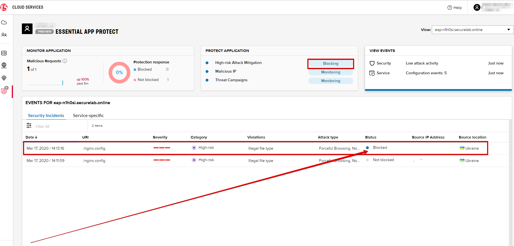

5. Update Monitoring to Blocking via Postman 
******************************** 

Let's first deactivate the blocking mode in the F5 UI.

`a)` Go to the **PROTECT APPLICATION** tab, then open the attacks you want to monitor, toggle **Blocking Mode** off and click **Update**.

**SCREENSHOT** 

`b)` Go back to Postman and send the **Update Monitor to Block** request which uses your “account_id” and "EAP record" retrieved in steps above. 

**SCREENSHOT** 

You will see the new "blocked" status of attacks in the response. 

**SCREENSHOT** 

You can also notice that their status changed in the F5 UI:

**SCREENSHOT** 

`c)` Testing the status 

Now that the protection mode is "blocking", you can send the **Attack: Illegal Filetype** and **Attack: SQL Injection** requests in Postman. 

**SCREENSHOT** 

After that go back to the F5 UI, open "VIEW EVENTS" section and you will see the new attacks with the "Blocked" status:

**SCREENSHOT** 

6. Block Country List
****************************

`a)` If you would like to block requests on a country-basis, go to Postman and sent the **Block country list** request which will use your "account_id" and "EAP record":

**SCREENSHOT** 

The response will show the countries blocked: 

**SCREENSHOT with US + DE + GB blocked**

`b)` Let's to to F5 UI and see the updated geolocation enforcemenet:

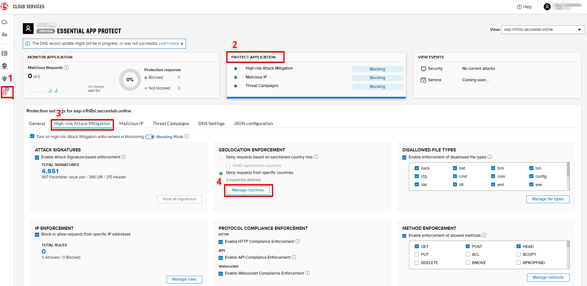

Click **Manage countries** to see the countries that are blocked: 

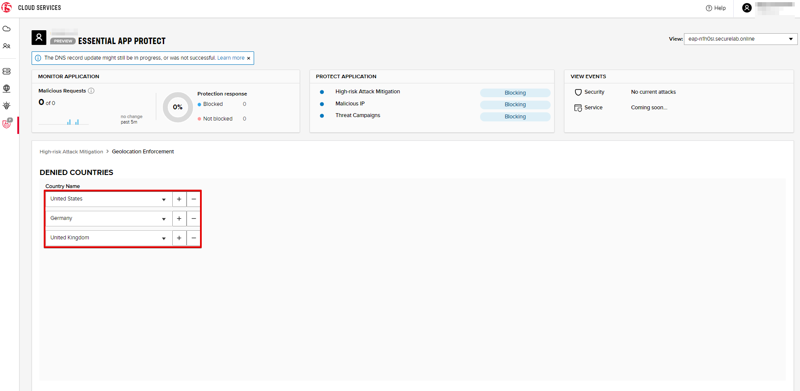

`c)` Let's test how country-base blocking works. Go back to Postman and send the **Test Country Blocking (lab)** request which uses your "EAP record". 

**SCREENSHOT** 

Let's open the F5 UI and go to VIEW EVENTS section to see the newly blocked attack based on geolocation: 

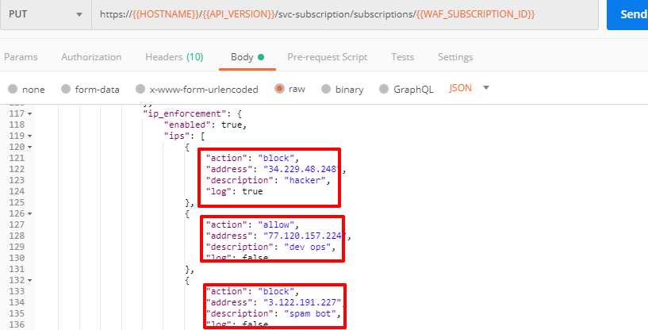

7. Update IP Enforcement Rules via Postman  
********************************

If you need to block or allow requests from specific ID addresses, it can be done in two way: via Postman or UI. If you prefer to do it via Postman, then follow the steps below. If your choice is UI, then procede to the next section.

Go to Postman and send the **Update IP Enforcement Rules** request which uses your "account_id" and "EAP record".

**SCREENSHOT** 

In the response you will see four blocked IPs and one allowed IP. 

**SCREENSHOT** 

8. Update IP Enforcement Rules via F5 UI  
******************************************

`a)` Select **PROTECT APPLICATION** in the Essential App Protect tab, select **High-risk Attack Mitigation** and then **Manage rules**. 

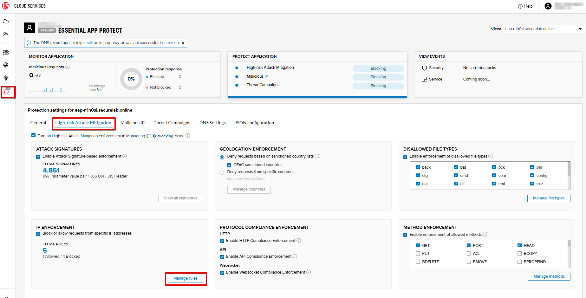

`b)` Fill in the required info and click **Update**:

**SCREENSHOT** 

9. Customize blocked page 
***************************

If you prefer to customize your blocked page, you can do it using Postman. 

`a)` First, let's see the page prior to sending the request. To do that, let's simulate an attack. Paste "**Fully Qualified Domain Name (FQDN)**/nginx.config" address to your browser. The result will be the following:

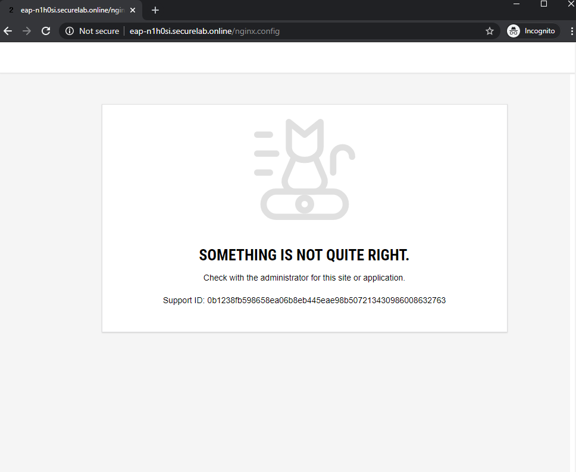

`b)` Go back to Postman and send the **Customize blocked page** request which uses your **account_id** and **EAP record**. 
 
**SCREENSHOT** 

`c)` Refresh the page in the browser opened one step above and you will see:

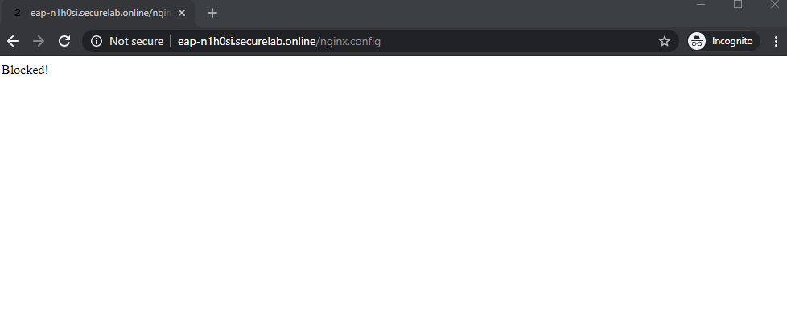

**Note**: It may take up to 1 minute. 

10. Add New Endpoints 
*********************

If you need to add new endpoints, you can do it via Postman.

Send the **Add new endpoints** request in Postman which uses your **account_id** and **EAP record**. 

**SCREENSHOT** 

You will see the Endpoint added in the returned response located in Europe (Frankfurt) and deployed on AWS:

**SCREENSHOT from postman** 

You will also see the new endpoint in the F5 UI:

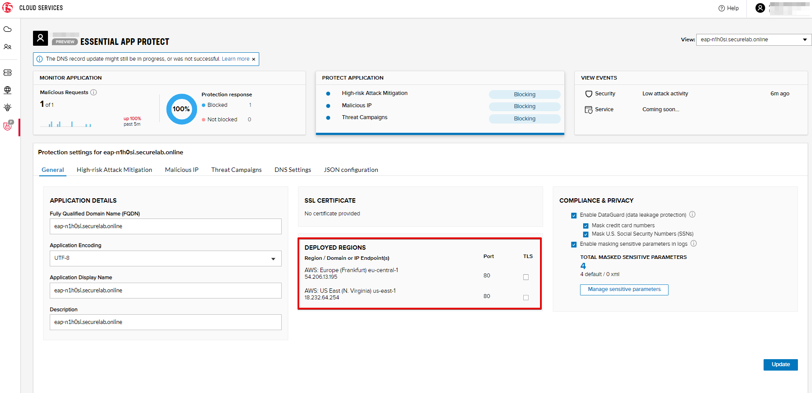

11. Test New Endpoint via Postman
***********************************

Let's now test the endpoint we've just created via Postman.

Send the **Test Second Endpoint (lab)** request which uses your "EAP record". 

**SCREENSHOT from postman** 

Here's what you should see in the response:

**SCREENSHOT from postman** 

12. Test New Endpoint via the Opera Browser 
******************************************

Open the Opera browser, click **VPN** and select **Europe**. This will simulate your entering http://auction.cloudservicesdemo.net/ from Europe.

**SCREENSHOT from OPERA** 

You will see that you are switched to the European endpoint. 

Now select **Americas**. This will simulate your entering http://auction.cloudservicesdemo.net/ from America.

**SCREENSHOT from OPERA** 

You will see that you are switched to the American endpoint. 

13. Start EAP Attack (lab) 
*************************

14. View Events via Postman  
************ 

15. View Events via UI  
**************************** 

The results of the attacks will be shown in the Essential App Protect **VIEW EVENTS** tab of the F5 Cloud Services portal. 

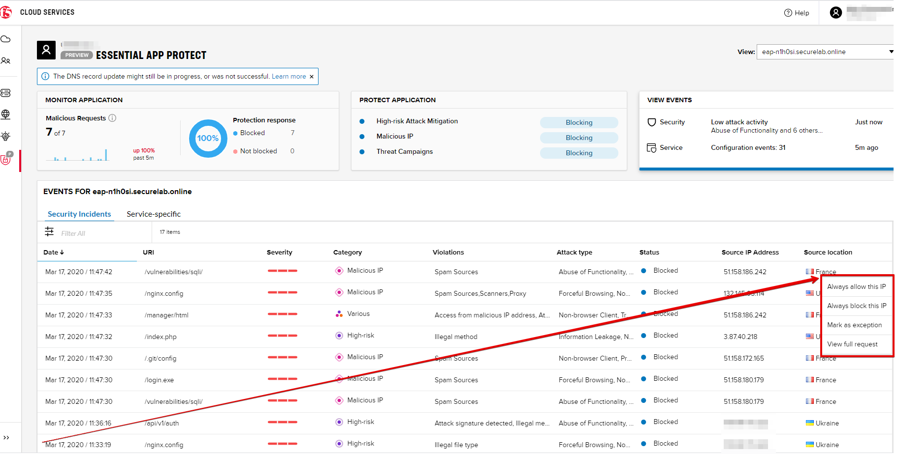

16. Specify SSL Certificate via Postman
***************************

`a)` Get SSL Certificate 

`b)` Upload 

`c)` Update 

17.  Clean Up  
********** 

In order to delete Essential App Protect instance, go to **Essential App Protect** tab, select **All my applications** in the dropdown menu, tick your application and click **Delete**. Now just confirm your choice. 

.. figure:: _figures/112.png 

 
