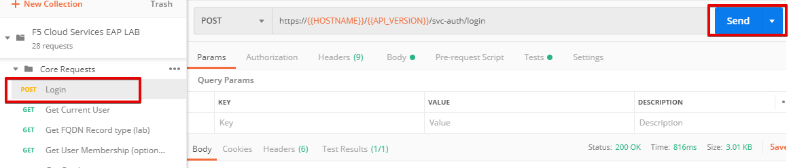
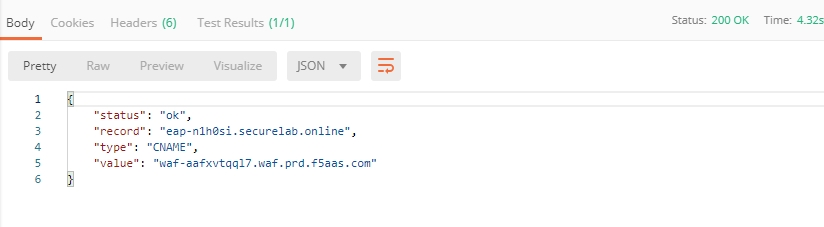
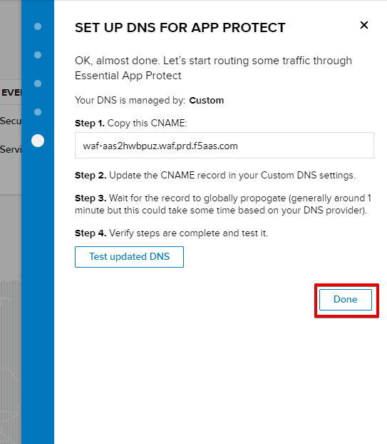
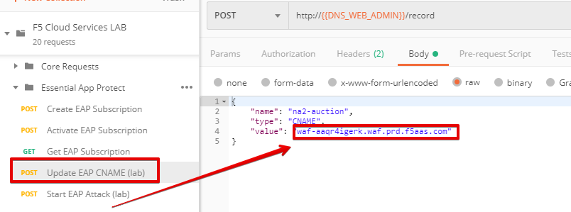
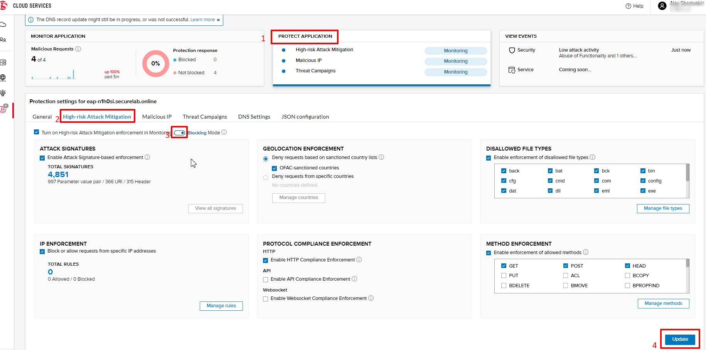

Agility LAB: Essential App Protect   
=========================================== 

.. contents:: Table of Contents   

Environment Setup  
############################### 

Lab Environment Overview
###############################

1. APIs and Services 
*********************

This Lab utilizes standard *F5 Cloud Services API*, as well as a *Lab Service API*, which was custom-built just for executing this lab: 

* **F5 Cloud Services API**: create, use, and remove the services in scope of this lab 

* **Lab service API**: facilitates auxiliary functions for the lab only: creating DNS entries, sending targeted requests & traffic to the apps/services, etc.  

The following diagram captures the core components of this Lab: 

 .. figure:: _figures/Diagram.png

1. F5 Cloud Services Portal 
*************************** 

`a)` Login   

In order to subscribe and use F5 Cloud Services, you need to go to the F5 Cloud Services portal and `log in <http://bit.ly/f5csreg>`_.  

`b)` Subscribe to Catalogs   

In order to make F5 Cloud Services available, you need to subscribe to them.   

   `1.` Click **Your F5 Cloud** tab in the left navigation panel and you will see the available services, as well as services you have subscription to, if any. Then click **Subscribe** for **DNS** and **Essential App Protect** services.   

   .. figure:: _figures/2.png  

   `2.` You will be asked to add your payment card to cover service usage. Note that you pay only for what you use.   

   .. figure:: _figures/3.png  

   After successful subscribing, your services will appear in **Your F5 Cloud** tab. You will also see their current status.   

   .. figure:: _figures/4.png  

   If you need to check your payment information, it is available in **Accounts** tab, **Payment** section.   

   .. figure:: _figures/5.png 

2. Postman Configuration  
********************* 

`a)` Download Postman `here <http://bit.ly/309wSLl>`_, open it, create a Postman account if you don’t have one and choose to do so, and sign in.  

`b)` Import collection – **F5 Cloud Services LAB.postman_collection.json** and environment – **F5 Cloud Services LAB.postman_environment.json**.  

.. figure:: _figures/1.jpg  

You will now see your collection (left side) with calls in several categories, as well as environment variables (top right).  

.. figure:: _figures/91.png 

You are now ready to interface with F5 Cloud Services using Postman. 

3. Zone Name  
********** 

In order to create Essential App Protect instance in the F5 Cloud Services portal, you need first to create DNS service which will require a zone name. Use Postman and follow the steps below to get the Zone name.     

`a)` Open the “F5 Cloud Services LAB” environment variables by clicking the “Environment Quick Look”, click into the field of the corresponding variable, and type the value of user email in the variable “USER_EMAIL” (click Enter after typing the values).  

Repeat the same for the “USER_PASSWORD”.  

`b)` Select the **Login** request in the sidebar to login to your F5 Cloud Services profile and click **Send** to get the authorization token. More detailed information on this API request can be found `here <http://bit.ly/36ffsyy>`_.  

A successful login will result in Postman returning the tokens from the API, shown in the response body below:  

.. figure:: _figures/84.jpg  

These tokens are then stored for subsequent calls using a function inside Postman to set environment variables. You can see the test function in the “Tests” tab:  

.. figure:: _figures/9.jpg  

**NOTE**: If any of the subsequent Postman calls return a blank response or **"status": "unauthorized" response** (see the screenshot below), it means your user token has expired and you will need to re-login. To do that you just need to re-send the **Login** request.  

`c)` Retrieve User ID & Account ID  

Select the **Get Current User** request and click **Send** to retrieve User ID and Account ID to be used in the further requests.  

.. figure:: _figures/86.jpg  

The response returns the following detail:  

.. figure:: _figures/12.jpg  

The retrieved User ID and Account ID are then stored for subsequent calls.  

More detailed information on this API request can be found `here <http://bit.ly/37hyQw3>`_.  

`d)` Let’s now retrieve DNS Zone Name with the **Get DNS Zone (lab)** API Call. Click **Send**. This call will pass your “ACCESS_TOKEN” in the header of the request to the Labs API in order to validate existence of your F5 account & return back a Zone name unique to your lab.  

Request:  

.. figure:: _figures/74.png  

The response will return your test DNS zone name and the status.  

Sending this request will automatically capture of the Zone variables:  

This Zone Name will be used for creating services in the F5 Cloud Services portal, as well as throughout the lab as the domain name for your test applications. 

DNS Service  
########### 

1. Create Secondary DNS Zone 
**************************** 

Let’s now return to the F5 Cloud Services portal and create Secondary DNS Zone.   

`a)` Go to **DNS** tab and click **Create**.  

`b)` Paste **Zone name** retrieved in step 3.d) above and indicate ** 54.211.12.173 ** as DNS Primary Server IP. Other values are optional. Then click **Get Zone File**.    

`c)` This will retrieve the zone file from your primary DNS server. Click **Deploy** and then **Done**. This will create Secondary DNS Zone.     

Essential App Protect 
################## 

1. Create Essential App Protect Service via the F5 Cloud Services Portal  
************************************* 

`a)` You will need a domain name to create Essential App Protect service. To get it, open **DNS** tab in the F5 Cloud Services portal and click the zone we’ve just created. 

`b)` Scroll down to copy the domain name for the NA2 endpoint: 

`c)` Go to **Essential App Protect** tab, select **All my applications** in the dropdown menu and click **Create**. 

`d)` Paste the domain name you copied in step 1.b) above and click **Save & Continue**.  

The system will gather app endpoint and region detail, show them and ask you to **Save & Continue**.  

As you can see, the endpoint belongs to North America, US East (N. Virginia) and is deployed on Amazon AWS.  

`e)` The system will ask you to provide a SSL/TLS certificate. Let’s tick “I will provide certificate details later” and **Save & Continue**.  

`f)` Enable all the options and click **Save & Continue**. 

`g)` Copy CNAME and click **Done**.  

Now that your Essential App Protect instance is created, we need to change DNS settings using CNAME and start routing the traffic through Essential App Protect. To do that follow the steps below.  

2. Update DNS Settings using CNAME  
******************************** 

`a)` Go back to Postman to change the DNS settings. Paste CNAME you copied in item 1.g) above and paste into the body of  **Update EAP CNAME (lab)** request.  

Send the request and you will see the following response: 

Now your DNS settings are updated which can be seen in **Zone file** in **DNS** tab back in the F5 Cloud Services portal: 

App traffic now goes through Essential App Protect instance and is actively protected. 

`b)` Let’s now test if CNAME change is completed correctly.   

Return to the F5 Cloud Services portal, open **Essential App Protect** tab, select your app from the dropdown menu and click **PROTECT APPLICATION**. Then open **DNS Settings** tab and click **Test updated DNS**.  

.. figure:: _figures/106.png 

You will see the status of testing. 

3. Update Monitoring to Blocking 
************************** 

By default, all the threats of your app are only monitored without any actions taken. To start blocking them, go to **PROTECT APPLICATION** tab, then open the type of attack you want to block, toggle **Blocking Mode** on and click **Update** to save the settings:  

4. Attacks  
******** 

There are three types of attacks:  

`a)` SQL Injection 

This attack inserts a SQL query via the input data field in the web application. Such attacks could potentially read sensitive data, modify and destroy it. More detailed information can be found `here <http://bit.ly/2RfmXkw>`_.

`b)` Illegal Filetype 

This attack combines valid URL path segments with invalid input to guess or brute-force download of sensitive files or data. More detailed information can be found `here <http://bit.ly/30NrAFF>`_.  

`c)` Threat Campaign 

These types of attacks are the category that F5 Labs tracks as coordinated campaigns that exploit known vulnerabilities. This particular attack simulates using a known Tomcat backdoor vulnerability. The complete list of such threats can be found `here <http://bit.ly/36bPmfG>`_.   

Let’s now try and simulate an attack. When attackers are trying to retrieve a configuration file nginx.conf for our application by guessing a path, we actively block them.   

   `1.` Copy Zone name in the F5 Cloud Service portal, **DNS** tab:  

   .. figure:: _figures/107.png 

   `2.` Insert the Zone name to the following address and open it in your browser: 

   **http://na2-auction.{{ZONE_NAME}}/nginx.config** 

   You will see the following response, which means that your app is both monitored and blocked:  

   .. figure:: _figures/108.png 

   `3.` Now you can go back to the F5 Cloud Services portal and update blocking to monitoring only for all threat types: 

   .. figure:: _figures/109.png 

   `4.` Update the address used in step 2 above to see that your app is only monitored but not blocked, and the file is downloaded:  

   .. figure:: _figures/113.png

5. View Events  
************ 

The results of the attacks will be shown in the Essential App Protect **VIEW EVENTS** tab of the F5 Cloud Services portal. 

.. figure:: _figures/111.png 

6.  Clean Up  
********** 

In order to delete Essential App Protect instance, go to **Essential App Protect** tab, select **All my applications** in the dropdown menu, tick your application and click **Delete**. Now just confirm your choice. 

 
